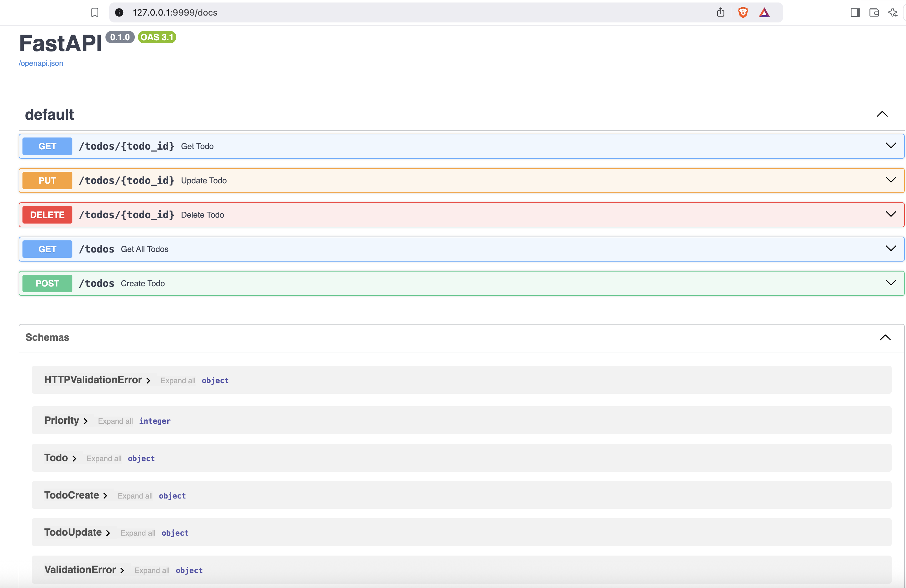

# FAST API Todo App

A simple yet comprehensive Todo list API built with FastAPI that demonstrates CRUD operations, data validation, and modern Python web development practices.

## Features

- **Complete CRUD Operations**: Create, Read, Update, and Delete todo items
- **Data Validation**: Robust input validation using Pydantic models
- **Priority System**: Three-tier priority system (HIGH, MEDIUM, LOW)
- **Interactive API Documentation**: Built-in Swagger UI for testing endpoints
- **Type Safety**: Full type hints throughout the application
- **Error Handling**: Proper HTTP exception handling

## API Endpoints

| Method | Endpoint | Description |
|--------|----------|-------------|
| GET | `/todos` | Get all todos (with optional limit) |
| GET | `/todos/{todo_id}` | Get a specific todo by ID |
| POST | `/todos` | Create a new todo |
| PUT | `/todos/{todo_id}` | Update an existing todo |
| DELETE | `/todos/{todo_id}` | Delete a todo |

## Installation & Setup

1. **Install required packages:**
   ```bash
   pip install fastapi uvicorn scarlet
   ```

2. **Run the application:**
   ```bash
   uvicorn main:api --port 9999
   ```

3. **Access the API:**
   - **API Base URL**: `http://localhost:9999`
   - **Swagger UI**: `http://localhost:9999/docs`

## Screenshot

### Swagger UI Interface



## Learning Outcomes

### FastAPI Framework Understanding

Through building this application, I gained comprehensive knowledge of:

- **Automatic API Documentation**: FastAPI automatically generates interactive API documentation using OpenAPI/Swagger, making it incredibly easy to test and understand the API endpoints
- **Path and Query Parameters**: Learned to handle both path parameters (`/todos/{todo_id}`) and query parameters (`?first_n=2`) effectively
- **HTTP Methods**: Implemented all major HTTP methods (GET, POST, PUT, DELETE) with proper use cases
- **Response Models**: Understanding how to define what data structure each endpoint returns

### Pydantic (Data Validation)

- **BaseModel Inheritance**: Created a hierarchy of models (`TodoBase` → `TodoCreate`, `Todo`, `TodoUpdate`) that promotes code reusability
- **Field Validation**: Implemented sophisticated validation rules including:
  - String length constraints (`min_length`, `max_length`)
  - Required vs optional fields
  - Custom descriptions for API documentation
- **Type Safety**: All data is automatically validated against defined types, preventing runtime errors
- **Enum Integration**: Used `IntEnum` for priority levels, ensuring only valid priority values are accepted


### API Design Best Practices

- **RESTful Design**: Followed REST principles with proper HTTP methods and status codes
- **Consistent Response Structure**: All endpoints return consistent JSON responses
- **Optional Parameters**: Implemented optional query parameters for flexible data retrieval
- **Partial Updates**: The PUT endpoint allows partial updates using optional fields

## Key Takeaways

This project provided hands-on experience with:
- Modern Python web development using FastAPI
- Data validation and serialization with Pydantic
- RESTful API design principles
- Automatic API documentation generation
- Type-safe Python development
- Error handling in web applications

The combination of FastAPI's simplicity and Pydantic's validation power makes for a robust, maintainable, and well-documented API that's ready for production use.